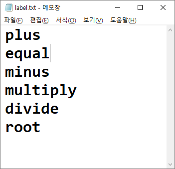
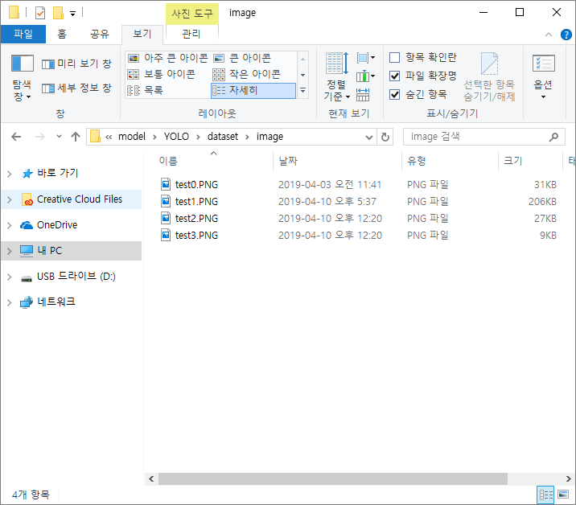
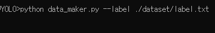
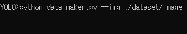
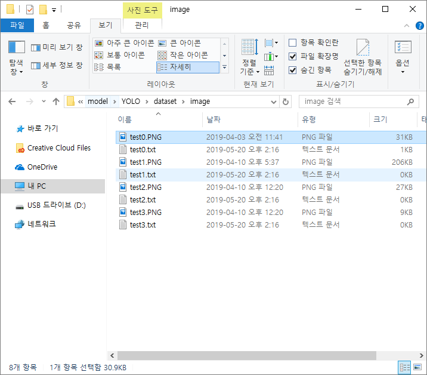

 # Yolo_keras
 
Make yolo model with keras

### Data_maker
It help you to make yolo data like (x, y, w, h, label_idx)\
requirement: cv2, numpy

comand input: --img, --label

---

### How to use data maker

>1. You need to ready label list.  

>2. You need image set for trainig  
  
>3. Execute data maker ex) python data_maker.py   
3.1 You can set label path with --label argument  
    ex) python data_maker.py --label label_path      
      
3.2 You can set img path with --img argument  
    ex) python data_maker.py --img img_path  
      
>>difference in setting label path and image path is label path will be file path but image path be directory path.

#### Now , you can use data maker!
>mouse left click for draw bounding box  
keyboard button  
>>n(next image)  
p(prev image)  
u(up label)  
d(down label)  
c(clear bounding box)  
b(remove prev bounding box)  
s(save labeling info)

When you save labeling info, it will be saved in image path  
  

---
